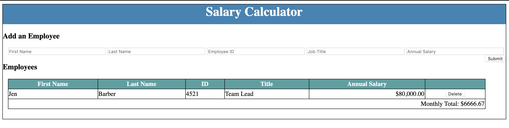

## Description
Duration: Weekend Project 

This Salary Caluclator allows users to enter new employee records to the page and calculate the monthly expected salary cost. If needed users may delete employee records and update the monthly salary expenses. 

## Screen Shot

## Installation 

Install this project by forking and cloning this github repository to local file system.

## Usage
1. Upon opening the page the  user sees a sample employee which they may delete 
2. User will fill out the fields for First Name, Last Name, Employee ID, Job Title and  Salary  and click Submit to add this record to the table and monthly expense total
    - Note: Employee Id should be a unique value
3. User may add as many employees as needed and view the calculated monthly expense
4. If the employees' monthly salary total is greater than $20,000 the user will see the background turn red
5. Users may delete employee records as needed and this will adjust the total monthly salary calculation

## Built With

- javascript 
- jQuery

## Roadmap
- Add check to make sure employee ids being added are unique and alert user if the id is already taken
- Add format check to make sure value entered in the annual salary input is a number
- Add auto formatting to table entries to correct the name or job title capitalization from user entered input
- Not designed for large employee sets as written. To account for this:
    - add ability to import a full employee list
    - add ability for user to configure expense threshold below or above $20,000
    - adjust total calculation so running total is stored and delete simply subtracts new value or appends new value on delete or add employee action

## Acknowledgement
Thanks to Prime Digital Academy. 
